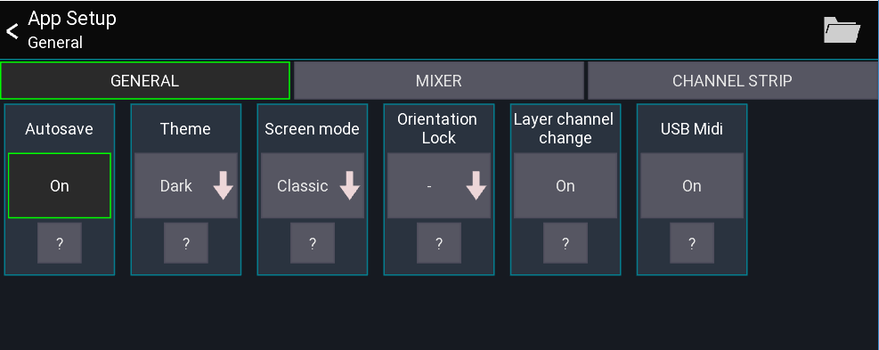
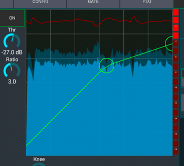

# App settings
This page gives an overview over the available app settings

## Open settings
The app settings can be opened via the menu from the *mixer view*
```
Menu -> Setup -> App
```



## General
In the general tab, all settings which affect the whole app are shown.
You can press the `?` for more details. Some special settings are explained here in more detail.

### Layer channel change
By default the `<-` and `->` buttons in the channel view will go to the next / previous channel of the mixer, regardless of the current layer configuration in the app.
Enabling this option will follow the layer configuration instead.

#### Example
The option is enabled and your current layer configuration looks like this
```
Band
	Ch 1
	Ch 2
	Ch 3
	Ch 5
Vocal
	Ch 11
	Ch 13
	Ch 14
```
Opening `Ch 5` and pressing the `->` will change the view to `Ch 11` instead of `Ch 6`


### USB Midi
Enables the USB midi stack. This should only be enabled if you're using this functionality as it consumes more battery

## Mixer
These settings are related to the mixer and channel views

### Gate/Dyn Timeline
Enables a history plot of the gate/dynamics input and gain reduction signal.


### Popgroups
Enables a midas pro style popgroup functionality.
When tapping on a channel button of a DCA/group the assigned channels will be shown in the mixer instead of opening the DCA/group. To edit an DCA/IDCA while popgroup mode is enabled **press and hold** the channel button.

#### IDCA
When selecting an IDCA in popgroup mode the shown channels do **not** follow the currently selected sends on fader selection. Instead the assigned target mix of the IDCA will be used.


## Channel strip
These settings are only related to the channel strips

### Fine fader ratio
Changes the sensitivity of the fader when fine mode is enabled

### Channel click
Changes the behavior when taping a channel button

### Channel long click
Changes the behavior when long pressing a channel button