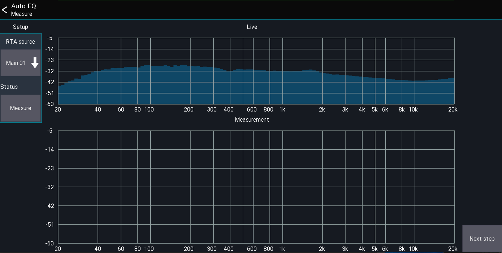
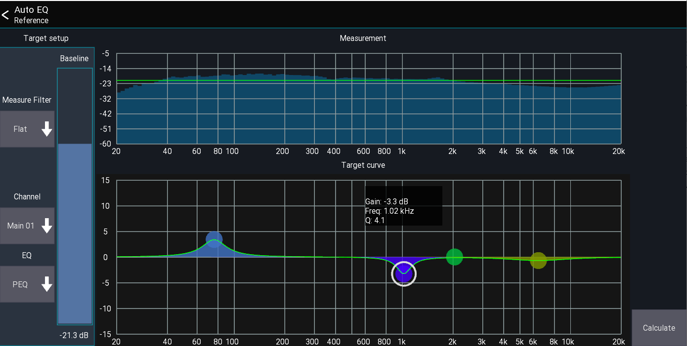

The Auto EQ feature automatically adjusts an EQ to match a specified target curve. 
It is not designed to replace your ears! In the end you decide what sounds best.
It is just a tool, use it wisely.

Warning: This feature is still work in progress

## Requirements
1. Measurement mic
2. Spare channel

## Usage
1. Make sure to disable / reset any EQ applied to the PA.
2. Connect the measurement mic to a free channel.
3. Select `Auto EQ` from the main menu to display the "Measure" page as shown below.

4. Select the measurement mic's channel. The RTA of the mic is then shown at the top of the screen.
5. Start pink noise at roughly the level you will be playing.
6. Press `Measure`. The measurement takes ~3-5 seconds.
7. Press `Next` to continue to the reference setup page as shown below.
Here you can configure how the system is calibrated.

8. Use the `Baseline` slider to adjust the green `0 dB` line. Everything below this line is assumed to be "too quiet"; everything above it "too loud".
9. Select the channel the EQ should be applied to, and the type of EQ control that should be used. PEQ usually gives better results than GEQ.
10. The `Target curve` can be used to apply personal preferences to the calibration - for example, to have more bass, or more mids.
In the above screenshot, I want a little more bass and less signal at 1kHz.
11. Press `Next` to calculate the resulting EQ as shown below.

12. The result is displayed bottom right. You can make manual adjustments to the EQ before pressing `Apply` to apply it to the channel.
13. An estimate of the resulting spectrum is shown top right.
In the above example you can see that the app is trying to reduce the signal at 50-350Hz as it was above the green baseline. The highs gets boosted because they were below the baseline in the measurement.

Warning: This feature is still a work in progress