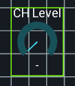

# Custom layout

This feature allows you to fully customize the mixer view to match your workflow
and create new views for different purposes (e.g. fixed installations).

## Structure
You can create an unlimited number of layouts, each of them has a set of UI elements as illustrated below.

- Layout Overview
	- Layout
		- UI items
			- One or more [action](custom-actions.md) per UI item

## Quickstart

1. Open the menu of the main view
2. `Menu -> Setup -> Layouts`
3. Press the `+` menu entry to add a new layout
4. Add and move UI items to your taste

> By default, the first custom layout you create will override the mixer layout.

## Layout Settings
While in the layout editor, press the `gear icon` in the top menu to open the layout settings as shown below.

Here you can rename your layout, or change the general behaviour.

### Behaviour
The layout behaviour option configures when and how the layout is applied to the app.

| Mode | Description
| --- | --- |
| Default | The layout is only shown if the user manually opens the layout |
| Override mixer layout | The layout replaces the default mixer layout |
| Open on startup | Opens the layout on startup |

The `Open on startup` option is designed for scenarios where you want to limit the accessible parameters (the top menu is empty).
Additionally it's possible to **password protect** the ability to return to the main mixer.

This allows you to create a dedicated layout (for example for a wall mounted tablet) and completely restrict access to anything else in the app.

## UI items
This section describes all available UI items and their configuration parameters.

### General
These settings are available for all UI items.

#### Settings: Visibility
This setting controls the conditions under which the UI is visible.

| Visibility | Description
| -- | -- |
| Always | Item is always visible |
| Only SoF | Item is only visible if SoF is active |
| Not SoF | Item is only visible if SoF is not active |

### Mixer 
Shows a container that displays all channels of the currently active layer.
This also includes the meterbridge (if enabled in the app settings).

### Channel strip
A single channel strip that can be assigned to a fixed channel,
or a dynamic channel source like the `Bus master`.
Do **NOT** use this if you want "something that follows the layer" - use the `Mixer` instead.

### SoF list
List of buttons for controlling the sends on fader, fine and mute enable status.

### Layer list
List of buttons for selecting a layer.

### Button
A button can be used to toggle the status of an action.

#### Settings: Label
Defines the text that is shown on the button. It is possible to write multiple lines of text.
See [Label Tags](##Label-tags) for more information.

#### Settings: Touch mode
It is possible to change the touch behaviour of the button.
This can be useful, for example, when you want to control a mute group via a long press only.

### Knob
A knob can be used to control a numeric value (like a send level or pan).

### Label
A label can be used to show values like the current scene, or just to display text.

#### Settings: Text position
Changes how the text is aligned on screen.

## Label tags
It is possible to use dynamic text as a label for the UI items. 
See [label tags](custom-actions.md#label-tags) for more details.

## Example: Tap delay button
1. Open the mixer layer setup
2. Add a button
3. Add a new action to the button
4. Select the FX action and select the Effect which you want to control
5. Select the time parameter of the FX
6. Go back to the mixer
