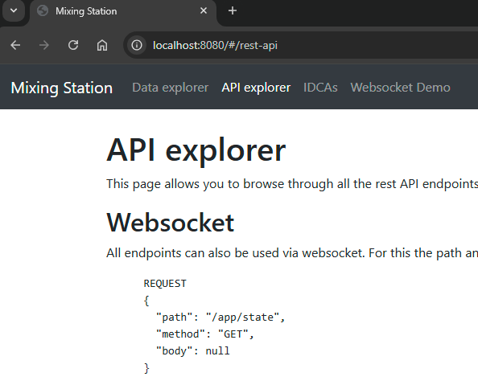

# APIs

Mixing Station provides different {{ abbr('API') }}s for integration with external software and hardware.
The goal of these APIs is to cover the majority of console parameters with a unified API, allowing your application to
work with every mixer supported by Mixing Station.

## Overview

Note that the *full* set of APIs is only available in the desktop version of Mixing Station.

| API  | Protocol            | Features                                                   |
|------|---------------------|------------------------------------------------------------|
| REST | http and websockets | App interaction, Mixer parameters, subscriptions, metering |
| OSC  | OSC via UDP         | Mixer parameters, subscriptions                            |

## Configure APIs

To enable {{ abbr('API') }} access, open the [global app settings](../settings/global.md) and enable {{ abbr('REST') }}
and/or {{ abbr('OSC') }}. Here you can also change the port number used by the APIs.

## Data Types

The following data types are used:

| Type     | Sample     |
|----------|------------|
| bool     | true/false |
| float    | 1.20       |
| long/int | 1          |
| string   | "hello"    |

There are two different value formats that can be used

| Format       | Description                                   | 
|--------------|-----------------------------------------------|
| Plain values | The actual value of the parameter (e.g. -5dB) |
| Normalized   | The value is normalized within the range 0-1  |

## REST

The REST API allows access via HTTP or websockets using json-encoded data.

### API Documentation

The full API documentation can be viewed via the REST api:

1. Enable the `HTTP REST` api in the global app settings
2. Open the following URL in your browser: `http://localhost:<your-configured-port>`

The webpage describes all available API endpoints and allows you to explore all data exposed by Mixing Station.
It also provides some sample UI which uses websockets to interact with Mixing Station.


### Websockets

Websocket requests use the following json scheme:

```json
{
  "path": "/app/state",
  "method": "GET",
  "body": null
}
```

Where `path` is the path of the API endpoint that you want to call, `method` is the
corresponding http method and `body` is the payload.

The response will look like this:

```json
{
  "path": "/app/state",
  "method": "GET",
  "body": {},
  "error": null
}
```

Where `body` contains the payload of the response, and `error` contains any
error messages that occurred during processing your request.

#### Value subscriptions

To receive value updates you'll need to subscribe first.
A subscription describes a parameter path for which the client will
receive updates in case of value changes.
Requesting a new subscription will also send you the initial value(s).

Examples of value subscriptions can be found below in the [examples section](#examples).

## OSC

The OSC interface provides access to the mixer parameters.
You can see all available parameters by opening the data explorer (follow the REST API steps above and open the
webpage).

Note that OSC bundles are **not** supported.

### Syntax

The following syntax is used to describe the OSC packets:

- `[]` Can be one of the chars inside.
- `{}` Placeholder which must be replaced with a value.
- OSC uses `0` bytes for padding. For better readability these padding bytes are not indicated below.

### Subscribe

Send the following packet at least once every 5 seconds to get updates for all parameters.
The last char determines the formatting.

Plain value

```
/hi/v
```

Normalized value

```
/hi/n
```

### Get data

An OSC packet without any parameters is used to request the current value.

```
/con/[vn]/{dataPath}
```

### Set data

Setting the data is similar to getting but with additional parameters.
You can use any of the supported data types described above.

```
/con/[vn]/{dataPath} f 0.0
```

## Examples

Here are some examples. For more details about the specific
API commands, please open the [API Documentation](#api-documentation) of mixing station.

### Websocket

Subscribe to the fader value of all channels:

```json
{
  "path": "/console/data/subscribe",
  "method": "POST",
  "body": {
	"path": "ch.*.mix.lvl",
	"format": "val"
  }
}
```

### OSC

This section shows example OSC packets.
Please keep in mind that OSC packets need to
be [properly padded](https://opensoundcontrol.stanford.edu/spec-1_0.html#introduction).

Get fader of ch 1 as dB value

```
/con/v/ch.0.mix.lvl
```

Get fader of ch 1 as normalized value

```
/con/n/ch.0.mix.lvl
```

Set fader of ch 1 using a dB value

```
/con/v/ch.0.mix.lvl f -5
```

Set fader of ch 1 using a normalized value

```
/con/n/ch.0.mix.lvl f 0.5
```