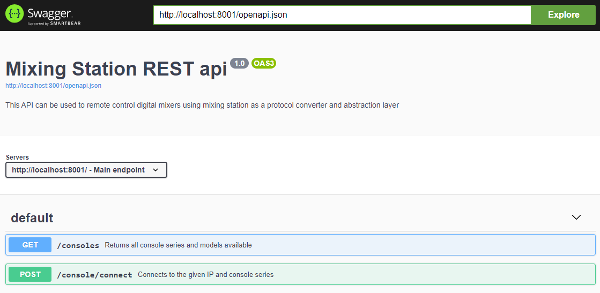

# APIs
Mixing station provides different APIs for external software and hardware to connect to.
The goal of these APIs is to cover most of the console parameters using a unified API.
This enables your app to work with every mixer compatible with mixing station.

## Overview
All APIs are only available in the desktop version of mixing station.
To enable an api make sure you start the programm with the correct [command line arguments](../platforms/pc.md)!

The following data types are used:

| Type | Sample |
| --- | --- |
| bool | true/false |
| float | 1.20 |
| long | 1 |
| string | "hello" |


All data can be get/set using two different data formats:

| Format | Description | 
| --- | --- |
| Plain values | The actual value of the parameter (e.g. -5dB) |
| Normalized | The value will be normalized into a range of 0-1 |


## REST
The REST api allows access via http using json encoded data.
By default CORS requests are allowed from any origin.

### OpenAPI
The documentation for the API is generated using OpenAPI.
To view the documentation:

1. Start mixing station with the web server enabled
2. Open the [swagger-ui](https://petstore.swagger.io/){target=_blank}
3. Enter the following url into the top text field `http://localhost:<web port>/openapi.json` and hit `Explore`

The editor should now show the documentation:


### Mixer data definition
If you just want to see all data available for the current mixer open your browser and enter `http://localhost:<web port>/console/data/definition`


## OSC
The OSC api has access to the same parameters as the rest api. Therefore it's possible to use the data model described in the rest api for implementing the OSC api. To see all `dataPath`s  available you need to use the rest api.

OSC bundles are **not** supported.


### Syntax
The following syntax is used to describe the OSC packets:

- `[]` Can be one of the chars inside
- `{}` Placeholder which must be replaced with a value
- OSC uses `0` bytes for padding. For better readability these padding bytes are not indicated below.

### Subscribe
Send the follow packet at least once every 5 seconds to get updates for all parameters.
The last char determins the formatting

Plain value
```
/hi/v
```

Normalized value
```
/hi/n
```

### Get data
A OSC packet without any parameters is used to request the current value.
```
/con/[vn]/{dataPath}
```

### Set data
Setting the data is similar to getting but with additional parameters.
You can use any of the supported data types above.

```
/con/[vn]/{dataPath} f 0.0
```


### Examples
Get fader of ch 1 as dB value
```
/con/v/ch.0.mix.lvl
```

Get fader of ch 1 as normalized value
```
/con/n/ch.0.mix.lvl
```

Set fader of ch 1 using a dB value
```
/con/v/ch.0.mix.lvl f -5
```

Set fader of ch 1 using a normalized
```
/con/n/ch.0.mix.lvl f 0.5
```