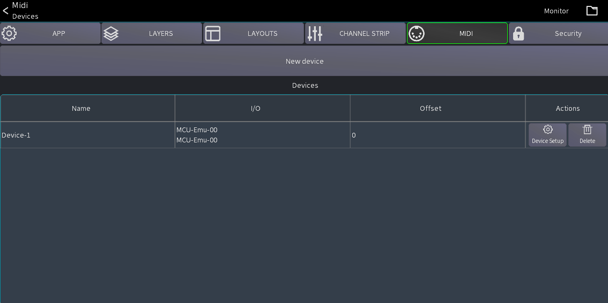
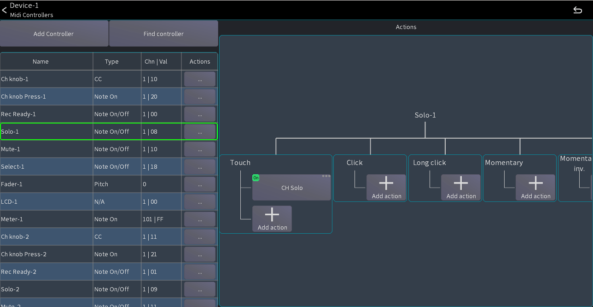
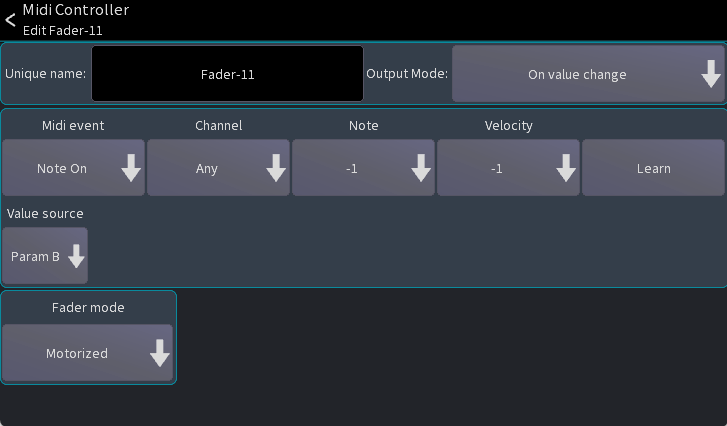

# Midi

You can use any generic midi device to remote control the mixer via Mixing Station.

## Supported protocols

- General Midi
- Mackie Control (MCU - recommended)
- X-Touch (in MCU mode, with metering and LCD support)
- X-Touch Expander (in MCU mode, with metering and LCD support)
- Waves FIT (in LV-1 Mode, with LCDs and colors)
- PreSonus Faderport Classic

## Known issues

### Android

In Android 5.0 (Lollipop) only the last plugged USB device is working correctly. This is
a [known bug](https://code.google.com/p/android/issues/detail?id=159897) in Android and cannot be fixed.

### iOS / MacOS

iOS 15/16 and macOS 13 have a bug in midi stack of the operating system causing them to not support fast sysex messages.
This causes MCU mode not to work correctly (faders moving to random locations).
Make sure to update to iOS 17/macOS 14.

### MCU (Mackie Control)

The MCU protocol is the recommended way to connect a midi fader extension to mixing station.
By default, the channels are mapped to the currently active layer.

#### Channel strips

| Control | Action                   | Description                                                                   |
|---------|--------------------------|-------------------------------------------------------------------------------|
| SELECT  | Select in Mixing Station | -                                                                             |
| MUTE    | Mute                     | -                                                                             |
| SOLO    | Solo/PAFL                | -                                                                             |
| REC     | Not assigned             | -                                                                             |
| VPOD    | Multiple                 | The knob can control multiple parameters depending on the selected assignment |

#### Buttons

| Control          | Action               | Description                                                       |
|------------------|----------------------|-------------------------------------------------------------------|
| TRACK (Assign-1) | Gain on knobs        | -                                                                 |
| SEND             | Sends 1-8 on knobs   | of the selected channel                                           |
| PAN/SURROUND     | Pan on knobs         | -                                                                 |
| PLUG-IN          | Gate on knobs        | of the selected channel                                           |
| EQ               | Not yet implemented  | -                                                                 |
| INSTRUMENT       | Dynamics on knobs    | of the selected channel                                           |
| -                | -                    | -                                                                 |
| < BANK >         | Prev / next layer    | -                                                                 |
| < CHANNEL >      | Scroll current layer | Scrolls 4 channels in the current layer (if more than 8 channels) |
| F1-F8            | Sends on fader       | Bus 1-8                                                           |

## Terminology

This section describes the terms used by Mixing Station:

- Midi Port: An input/output port for sending/receiving midi data.
- Midi Device: Represents a single physical device consisting of one input and output midi port.
- Midi Controller: A single fader/button/knob.
- Action Slot: A collection of actions that should be executed
- Action: A single action / value that should be bound to a Midi Controller

```plantuml
@startuml

[Midi Port] <--> [Midi Device]: Input/Output
[Midi Device] --> [Midi Controller]: has >=1
[Midi Controller] --> [Action Slots]: has >=1
[Action Slots] --> [Action(s)]: value source

@enduml
```

## Midi Controllers

There are three controller types available:

- Button: Midi device sends a value when pressed and/or released
- Fader: Midi device sends an absolute value when fader/knob is moved (e.g. `0-127`)
- Knob: Midi device sends a fixed value for each increment / decrement (e.g. `24` and `27`)

## Midi Setup

The midi overview can be opened from the mixer via the menu:

```
Menu -> Setup -> Midi
```

You can add / edit the midi devices form here:


### Add a new device

1. Press the `New device` button
2. Select the appropriate protocol and input / output ports you want to use.
3. Press `Apply`.

The following additional settings are available:

- Sof source: By default the midi device will follow the sends on fader settings of the app.
  You can change this to a fixed mix so the midi controller will only change that particular mix instead.
  (This only applies to actions using the `Main->On` and `Main->Fader` values).
- Ch offset: Allows you to configure a channel offset that should be applied. For example if you're using two midi
  devices and the 2nd one should control channel 9-16 you can set this parameter to `8`.

### Midi device overview

You can select a midi device to open its overview page.
This page shows all controllers assigned to the device (left table) as well as their
assigned actions (right side).

This view allows you to add new controllers or modify existing.



To find an existing controller simply press the `Find controller` button and then move/press any item on your physical
midi device. Mixing Station will automatically select the controller in the table.

### Add a controller

1. Select the midi device you want to add a controller to (click on the row).
2. Press the `Add Controller` button
3. Select the type of controller you want to add (see definition above!).

### Configure a controller

The edit controller view allows you to change the properties of the controller:


- Unique name: Name of this controller.
- Output Mode: Defines when Mixing Station will send out new values to the midi controller (see below).
- Midi parameters: Configures the midi parameters that are sent by the midi controller (see Mapping below).

#### Output Modes

The output mode configures when the value should be sent back to the midi device.

| Mode                 | Description                                                                                   |
|----------------------|-----------------------------------------------------------------------------------------------|
| On value change      | Sends midi value when the action value has been changed without a midi input                  |
| On midi event+change | Sends a midi event when a midi event was received or the action value has been changed        |
| On note up+change    | Sends a midi event when a "note up" command was received or the action value has been changed |

#### Mapping a midi parameter

In general, you can just press the `Learn` button and move/press the fader/button you want to assign.
The app will automatically detect the midi channel and parameter type.

You can also configure the parameters yourself:

- Event type: The event type defines what midi command the controller should react to.

  | Event type                                        | Description                                            |
  |---------------------------------------------------|--------------------------------------------------------| 
  | Note On/Off                                       | Triggers the action on "Note On" and "Note Off" events |
  | Note On |  Triggers the actions on "Note On" events              |
  | Note Off                                          | Triggers the actions on "Note Off" events              |
  | CC                                                | Triggers the actions on "Control Change" events        |
  | Pitch                                             | Triggers the actions on "Pitch" events                 |

- Channel: The midi channel that should be used
- Param A/B: These two selections are for filtering the midi parameter.
  Depending on the currently selected event type the names of the parameters will change.
  A value of `-1` means that the value will be ignored.
- Value source: Selects which midi parameter should be used as a value source.
  Example: A fader sends midi CC events. The position of the fader will be sent as `Value` of the CC command so this
  parameter should be used. Select `Param B` to choose the second parameter which in this case is
  the `Value` parameter.

  Note: Buttons do not require a value source because the action will be triggered as soon as a matching midi command is
  received.

#### Buttons

- Output "on" value: Sets the value that should be sent when the button is currently `on`. Some midi devices can show
  different colors depending on the midi value so this parameter can be used to change the color.

A button has multiple actions slots available.

| Slot           | Behavior                                          |
|----------------|---------------------------------------------------|
| Click          | Event needs to be > 0 and then 0 (press and lift) |
| Long click     | Event needs to be > 0 for a longer period         |
| Touch          | Event needs to be > 0 (triggers immediately)      |
| Momentary      | Event > 0 triggers "on", Event = 0 triggers "off" |
| Inv. Momentary | Same as `Momentary` but inverted                  |

#### Fader

- Fader mode: Defines how mixing station should react to received values.
    - In `Motorized` mode the values are always accepted and applied.
    - In `Non-motorized` mode the fader must first be moved to the current value
      before the app will start processing the movements.

#### Knob

- Multiplier: Sets the sensitivity of one increment/decrement step
- Inc value: Midi value for a single increment
- Dec value:  Midi value for a single decrement
