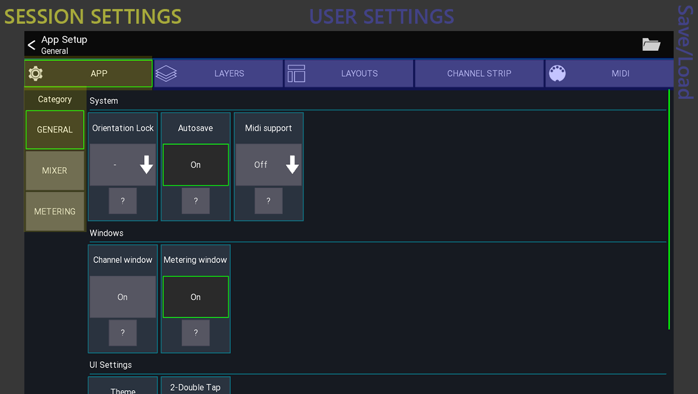
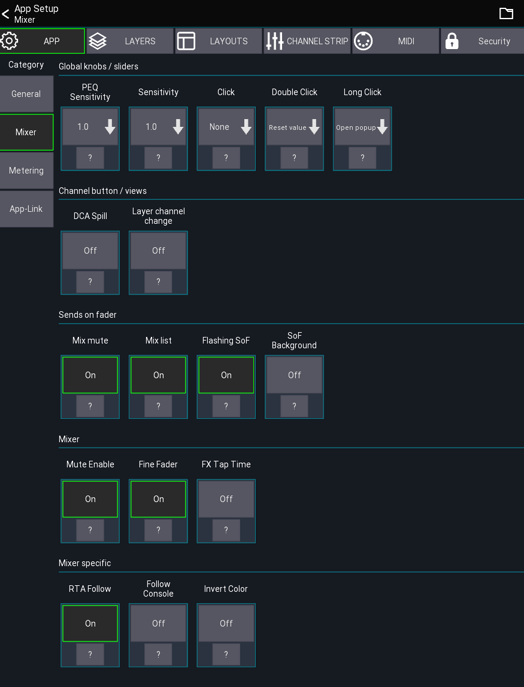
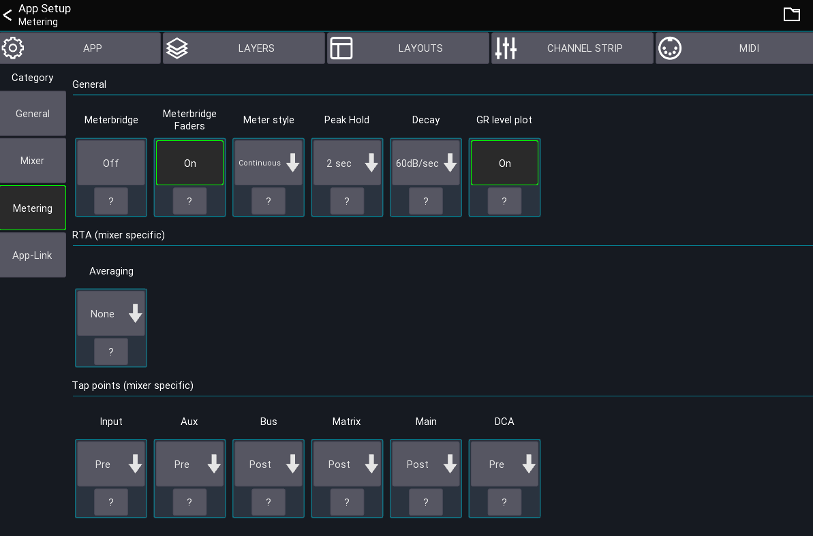

# User / Session settings
This page provides access to all session and user settings

## Open settings
The app settings can be opened via the menu from the *mixer view*
```
Menu -> Setup -> App
```

## App tab

The first tab contains all *session settings*. On the left side you have different setting categories available.

You can press the `?` for more details. Some special settings are explained here in more detail.

### Orientation lock
If supported by the platform you can lock the orientation of the device. If not available please use the OS mechanism for locking the screen.

### Autosave
When enabled automatically saves all `User settings` as `default` when leaving any settings view.

### Windows
>PC only

These settings allow you to configure the multi window behavior of the app.

### USB Midi
Enables the USB midi stack. This should only be enabled if you're using this functionality as it consumes more battery.

## Mixer category


These settings are related to the mixer and channel views

### Global knobs / sliders
This section configures how the knobs/sliders should behave. This setting is applied to all knobs in the app, excep sliders in a channel strip. These can be configured in the `Channel Strip` tap.


### Popgroups
Enables a midas pro style popgroup functionality.
When tapping on a channel button of a DCA/group the assigned channels will be shown in the mixer instead of opening the DCA/group. To edit an DCA/IDCA while popgroup mode is enabled **press and hold** the channel button.

When selecting an IDCA in popgroup mode the shown channels do **not** follow the currently selected sends on fader selection. Instead the assigned target mix of the IDCA will be used.

### Layer channel change
When enabled, the `<-` and `->` buttons in the channel view will follow the current layer instead of the default channel order.
#### Example
The option is enabled and your current layer configuration looks like this
```
Band
	Ch 1
	Ch 2
	Ch 3
	Ch 5
Vocal
	Ch 11
	Ch 13
	Ch 14
```
Opening `Ch 5` and pressing the `->` will change the view to `Ch 11` instead of `Ch 6`

### FX Popup
When enabled shows tap delay buttons in the mutegroup popup.

### SoF list
When enabled shows a sends on fader list instead of the dropdown menu.

### RTA Follow
When enabled the app will always change the RTA source to the currently opened channel.
Depending on the mixer this means that the app will change the PAFL selection.


## Metering category

In this section you can configure everything related to signal metering and RTA.

### Gate/Dyn Timeline
Enables a history plot of the gate/dynamics input and gain reduction signal.


### Tap points
Depending on the mixer you can change the signal tap points that should be used for showing the meters.
If you mixer doesn't support this feature it will not be shown in the app.