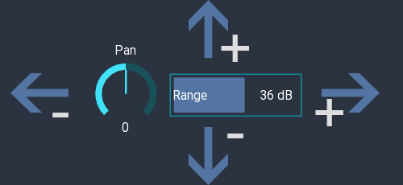

# UI Controls

This page shows the most common UI controls and how to use them.

You can always also use **right click** instead of **press and hold** if you're using a mouse.

## Buttons

| On                                                   | Off                                                    |
|------------------------------------------------------|--------------------------------------------------------|
|  |  |

### Long click

Buttons with an indicator (`...`) in the top right have a long-click action.
You can press and hold or right-click the button.

## Knobs

### Default behaviour

- **Drag** to change the value
- **Press and hold** to open a popup for more precise control
- **Double tap** to reset the value to the default

This behaviour can be configured in the [app settings](settings/user_session.md).

### Dragging

Knob values can be increased by dragging them up or to the right.
When dragging to the top right, the values will increase more rapidly.
To decrease the value just use the opposite direction as shown in the image below.

## Faders

Drag the fader knob to change the value. If **fine mode** is enabled you can start dragging the fader from any position
and the movements will be more precise.

Additionally you can tap the red area to nudge the fader by 0.25db increments.

- GEQ: **Double tap** to reset the value

## Sliders
The behavior of the sliders can be configured in the [app settings](settings/user_session.md).
Default behavior:

- **Double tap** to reset the value to the default
- **Drag** to change the value

Sliders are used in some FX views and in the knob popup described above.
The white line indicates the default value for this parameter.

## Channel buttons

The behavior of these button can be configured in the [app settings](settings/user_session.md).
Default behavior:

- **Tap** Open channel details
- **Press and hold** Open scribble strip

## Mixer sidebar

Contains two **scrollable** bars for layer and access to [sends on faders](sends-on-faders.md)

### Fine mode

When enabled faders will be more less sensitive and you can make smaller adjustments.

### Mute enable

Enables/disables every channel mute button in the app.

### Layer buttons

Each button provides access to a single layer

- **Tap** Select layer
- **Press and hold** Edit this layer

> PC only

- **Press and hold** Allows you to open the layer in a separate window.

## Menu bar

The top menu provides access to other views and options. Depending on the current platform and view you're in the items
will change.

### Status

On the left side the current view and additional information are shown

### Menu items

The menu items are shown in a fixed order. If too many items are in the menu, they will be hidden and a `...` item is
shown to access other items.

## Quick access

### Mute groups

You can always open the mute groups from any view by **double tapping with two fingers** anywhere
on the screen

### Clear solo

**Press and hold** the solo button to clear all solo.
The button can be enabled in the channel strip via the [app settings](settings/channel-strip.md).

